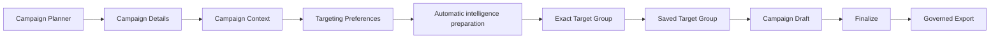
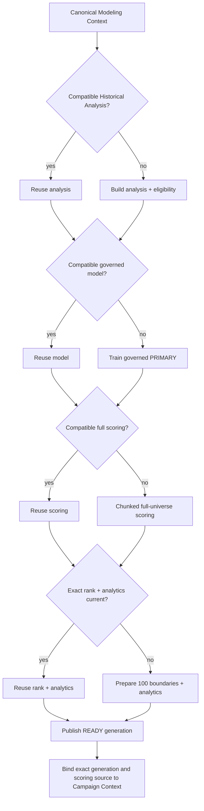
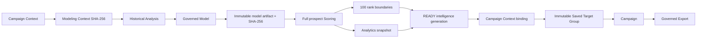

# Phase 10 Implementation Summary

Phase 10 delivers automatic Campaign Intelligence Orchestration above the Phase 9 business Campaign Planner. It derives an exact analytical identity from Campaign Context, reuses only fully compatible current work, builds only missing or invalid layers, publishes a verified source back to Phase 9, and preserves immutable lineage through Target Group, Campaign, and governed export.

## Business flow

Business users remain in Campaign language. The default UI reports preparation states, progress, reuse, readiness, and actionable recovery without requiring model or scoring identifiers. Technical IDs, hashes, source checksums, and contract versions remain behind progressive disclosure.

## Analytical orchestration

The parent orchestration is durable and idempotent. It persists one exact reuse plan, joins active equivalent work, resumes from the highest verified compatible layer after failure, and runs child training/scoring directly rather than submitting nested work into the shared bounded executor.

## Modeling Context and compatibility

Modeling Context v1 includes products, campaign types, campaign categories, offer types, historical campaign channels, attributed-purchase/contacted-only label semantics, and governed historical-window/multi-product policy versions. Values are normalized, sorted, de-duplicated, serialized as canonical UTF-8 JSON, and hashed with SHA-256.

Compatibility is layered:

1. Historical compatibility binds the Modeling Context, exact resolved date/filter window, customer checksum, and campaign-sales checksum.
2. Model compatibility binds the exact analysis, feature contract/hash, role and evaluation contracts, eligibility/training policies, seed, validation fraction, and challenger policy.
3. Scoring compatibility binds the exact model/artifact, demographic checksum/count, unit-interval score semantics, ordering, and complete-universe requirement.
4. Rank/analytics compatibility binds the exact scoring run, 100-boundary rank contract, and current analytics snapshot.

There is no latest-run fallback. Candidate generations and legacy analytical runs must pass exact compatibility and current-source checks before reuse.

## Invalidation matrix

| Change | Modeling hash | Analysis | Model | Scoring | Rank/analytics | Targeting only |
|---|---|---|---|---|---|---|
| Product/type/category/offer/historical channel | Changes | Build | Build | Build | Build | No |
| Conversion/contacted or historical-window/multi-product policy | Changes | Build | Build | Build | Build | No |
| Customer or campaign-sales source checksum | Same context, historical fingerprint changes | Build | Build | Build | Build | No |
| Feature, model-role, evaluation, eligibility, or training policy | Same context | Reuse if exact | Build | Build | Build | No |
| Model artifact or artifact checksum | Same context | Reuse | Revalidate/build | Build | Build | No |
| Demographic source checksum/count or score semantics | Same context | Reuse | Reuse | Build | Build | No |
| Rank or analytics contract/currentness | Same context | Reuse | Reuse | Reuse | Build | No |
| Delivery channel, name, description, launch date | No change | Reuse | Reuse | Reuse | Reuse | Yes |
| Match Strength, demographics, branch filters, TOP_N/top percent | No change | Reuse | Reuse | Reuse | Reuse | Yes |

Every reuse cell still requires exact stored-lineage verification. Corrupt, failed, incomplete, stale, or unverifiable candidates fail closed.

## Provenance and data flow

Historical customer identity (`customer_id`) remains separate from prospect identity (`person_id`). Phase 10 adds no identity bridge. Planning, orchestration, preview, and lifecycle APIs expose no contact PII; contact data remains confined to acknowledged export of a finalized Campaign.

## Persistence and lifecycle

Schema version 15 adds:

- `phase10_intelligence_generations`: immutable compatibility identity and complete analysis/model/scoring lineage;
- `phase10_orchestration_runs`: durable parent state, progress, reuse plan, child IDs, and safe failure state; and
- `phase10_context_bindings`: exact Campaign Context-to-generation/orchestration publication.

Lifecycle reconciliation classifies generations as `CURRENT`, `REUSABLE`, `SUPERSEDED`, `STALE`, `RETIREMENT_ELIGIBLE`, or `PROTECTED`. References from Saved Audiences, Saved Target Groups, Campaigns, finalized Campaigns, export audit history, and active orchestration protect lineage. Reconciliation is metadata-only and never deletes scores, runs, or model artifacts.

## API additions

All Phase 10 routes extend `/api/campaign-planner/contexts/{targeting_context_id}`:

| Method | Route | Purpose |
|---|---|---|
| `GET` | `/intelligence-plan` | Read-only exact readiness and four-layer reuse/build plan |
| `POST` | `/targeting-intelligence/prepare` | Join, reuse, or start durable automatic preparation |
| `GET` | `/targeting-intelligence/preparation` | Poll persisted stage, progress, readiness, and safe messages |
| `POST` | `/targeting-intelligence/preparation/retry` | Retry from the highest verified compatible state |

The Phase 9 preview, search, recommendation, save, and Campaign Draft routes are unchanged. READY finalization atomically publishes the verified Phase 10 scoring run through the existing Phase 9 targeting-intelligence boundary.

## Recovery and concurrency

- Equivalent active requests converge on one durable parent.
- READY replay is idempotent and republishes the exact verified Phase 9 source if needed.
- Interrupted, stale, and failed work is reconciled explicitly; retry never treats an unverified latest run as compatible.
- Progress is monotonic and persisted.
- Analytical child work avoids nested shared-executor deadlock.
- Failure messages returned to business users are bounded and sanitized.

## Certification

- Comprehensive repository regression: 647 tests passed.
- Phase 10 focused suite: 89 passed.
- Bounded Phase 10 clean-room reuse/build/recovery: PASS.
- Installed-Chrome end-to-end business flow and control coverage: PASS.
- Clean-head full-scale certification: 5,000,000 scored, 5,000,000 distinct, zero duplicates/invalid/missing/extra, deterministic 256-row rescore difference `0.0`.
- Exact 100-boundary rank and one current analytics snapshot: PASS.
- Multi-branch Target Group, exact union/deduplication, Campaign linkage, legacy-safe reopen, and pre-export PII boundary: PASS.

Authoritative acceptance and SHA freeze status are recorded in `docs/evidence/phase10/PHASE10_FINAL_ACCEPTANCE.md` and `docs/evidence/phase10/PHASE10_FINAL_FREEZE_REPORT.md`.
