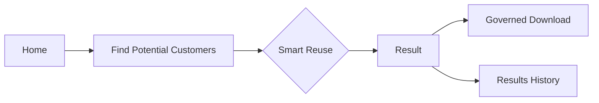
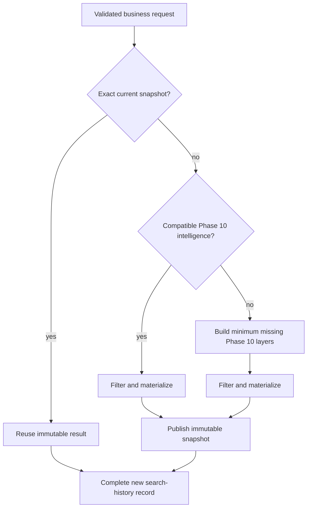

# Phase 11 Implementation Summary

Phase 11 delivers a simplified business workflow over the frozen Phase 9 targeting and Phase 10 intelligence layers. A business user moves through **Home → Find Potential Customers → Smart Reuse → Result → Download** while legacy analytical screens and APIs remain retained but hidden from normal navigation.

## Business flow

Home presents bounded business metrics and recent searches. Find Potential Customers is one validated form with searchable accessible multi-select controls. Every intentional submission creates its own immutable search-history record. Result detail reopens the exact saved context, criteria, selection, membership snapshot, currentness, and analytical lineage without exposing contact PII. Download applies the saved backend-owned channel profile at stream time.

Normal navigation contains exactly **Home**, **Find Potential Customers**, and **Results**. Result Detail is a child of Results. Legacy views, modules, and APIs are hidden, not removed. This presentation boundary is not authentication, authorization, or RBAC; the immutable view-group contract is the future RBAC seam.

## Smart reuse flow

The exact result cache key binds the current Phase 10 generation, canonical targeting criteria and OR branches, selection mode/count, and frozen filter/rank/membership contracts. It deliberately excludes campaign name, description, launch date, delivery channel, and export profile because those fields do not change analytical membership.

There is no all-permutation precompute. Phase 11 first validates an exact snapshot, otherwise delegates compatibility to Phase 10 and streams one requested membership in global rank order. The optional atomic-segment gate was completed against current Phase 11 generation 1/scoring run 3 over all seven required query shapes. Results were stable, and no additional structure was adopted because no candidate demonstrated a net runtime/storage benefit over the existing indexed Audience Engine plus exact-result reuse.

## Durable search and result model

Schema version 18 adds, in order:

- governed contactability, consent, and activation identifier columns on demographics;
- immutable `campaign_search_runs` business submissions;
- immutable `campaign_result_snapshots` metadata for contact-PII-free membership artifacts;
- append-only `campaign_result_export_events` aggregate download audits; and
- `campaign_search_future_lineage`, a nullable write-once seam for future activation, provider, feedback-batch, and outcome-dataset references.

Search history and result snapshots are different objects. Identical intentional submissions create distinct search rows but can share one validated snapshot. Snapshot membership is a deterministic gzip CSV containing only analytical fields (`person_id`, score, percentile bucket, decile, rank band) plus a complete immutable manifest. Contact fields are joined only during governed download and are never persisted in the snapshot.

Publication uses a bounded temporary directory, complete validation, file `fsync`, atomic rename, and a short SQLite transaction. Registry identity and checksum are immutable. Missing/corrupt artifacts can be repaired only when deterministic regeneration reproduces the registered count and SHA exactly.

## Omnichannel delivery and privacy

The backend owns ten versioned profiles: Email, Direct Mail, SMS, WhatsApp, Telemarketing, Paid Social, Paid Search, Mobile Push, Display, and Website Onsite. Availability is derived from the actual imported source schema; no identifier or consent is inferred. The current 40-column canonical demographic source supports all ten profiles, while each row must still pass its profile-specific identifier and consent/contactability/targetability checks.

Every download begins from the immutable selected membership, validates current source and lineage, joins only required demographic columns in bounded chunks, and emits only the exact profile allowlist. Paid-media exports contain lowercase SHA-256 email/phone match keys and never raw email or phone. Hashes are pseudonymous, not anonymous. Aggregate audit rows store counts, status, checksum, currentness, and safe errors—never contact values.

## API and compatibility

Phase 11 adds business overview, search submission/status/history, result detail, profile registry, and governed download endpoints under `/api/business` and `/api/potential-customer-search`. The Phase 1–10 API surface, legacy Campaign Email/Direct Mail workflow, model feature contract, and Phase 10 compatibility rules remain intact. Details are in `PHASE_11_API_AND_SCHEMA.md`.

## Recovery and lifecycle

- `QUEUED` and `PROCESSING` searches can resume after restart.
- Equivalent active Phase 10 work is joined through the existing durable orchestration layer.
- Exact snapshots fail closed on stale generation/source identity, missing files, schema/count/order mismatch, manifest mismatch, or checksum mismatch.
- Orphan cleanup is bounded, age-gated, symlink-safe, and limited to known result artifact names.
- Stale `RUNNING` export audits are reconciled to `ABORTED` without contact-row persistence.

## Future seams

The view contract preserves a future role-aware navigation seam, but Phase 11 does not implement RBAC. Schema 18 and the read-only completed-search lineage projection preserve a future feedback/retraining seam, but Phase 11 does not activate campaigns, ingest provider outcomes, build supervised labels, schedule retraining, promote challengers, or implement reinforcement learning. See `PHASE_11_FUTURE_FEEDBACK_LINEAGE.md`.

## Certification

- Comprehensive Step 20 regression: `966 passed`.
- Final bounded Step 21 regression: `855 passed`, `111 deselected`.
- Bounded Phase 11 CI selection: `261 passed`, `4 deselected` locally.
- Bounded clean-room A/B: all 10 scenarios passed with identical canonical result SHA.
- Installed Chrome end-to-end: all required business flows, all 10 profiles, 549 dynamic control/state observations, five responsive viewports, and zero browser/network errors passed.
- Full 5M: 5,000,000 distinct valid scores, exact reuse, intelligence reuse, delivery-profile reuse, deterministic source regeneration, governed downloads, SQLite integrity, and Phase 1–10 regression passed.
- Exact implementation-SHA GitHub CI: run `#20`, ID `35330170690`, all five required jobs successful for `feb18146499bf5a2856b1680b3f658d27db34482`.

Authoritative final status is recorded in `evidence/phase11/PHASE11_FINAL_ACCEPTANCE.md` and `evidence/phase11/PHASE11_FINAL_FREEZE_REPORT.md`.
