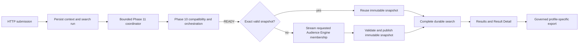

# Phase 11 Runtime Architecture

## Scope

This document describes the normal Phase 11 runtime in schema version 19. The production entry point is:

```powershell
python -m uvicorn app.main:app --reload
```

The FastAPI lifespan composes the Phase 11 coordinator automatically. Normal operation does not require a test server, injected executor, or manual worker setup.

The visible business UI contains exactly **Home**, **Find Potential Customers**, and **Results**. Result Detail is a child of Results. Legacy and analyst views remain implemented for compatibility but are hidden from normal navigation.

## Runtime ownership



Ownership is deliberately separated:

1. The HTTP submission boundary validates the business request, persists its Phase 9 context/criteria lineage, creates one immutable `campaign_search_runs` row, and hands off its identifier.
2. `Phase11SearchCoordinator` owns bounded asynchronous advancement and per-run duplicate suppression.
3. Phase 10 owns analytical compatibility, historical analysis, model, scoring, rank, analytics, and generation publication.
4. Phase 11 owns exact result-cache identity, requested membership resolution, immutable result-snapshot publication, durable search completion, history, and result detail.
5. The export service owns currentness revalidation, profile-specific contact joins, consent/contactability/targetability enforcement, streaming CSV, and aggregate audit.

No HTTP request directly owns a long-running model, scoring, or membership build. The durable database rows remain the source of truth across navigation, process loss, and restart.

## Coordinator contract

The application creates one coordinator with the initialized database, production `ResultSnapshotMaterializer`, and repository root. Its frozen bounds are:

- two Phase 11 worker threads;
- five-second Phase 10 polling interval;
- at most 100 tracked active searches;
- one active loop per search ID;
- durable statuses `QUEUED`, `PROCESSING`, `COMPLETED`, `BLOCKED`, and `FAILED`.

Each immutable search has a separate durable runtime row. It records lifecycle stage, monotonic progress, processed/total counts where the total is knowable, heartbeat, state version, and safe issue guidance. Phase 10's existing stage percentage maps to the first 90 percent; exact-cache checks and result materialization own the remaining progress. `ALL_MATCHING` materialization reports actual processed rows without inventing a final total. Results polling projects a bounded ETA only after measurable work begins and identifies the estimate basis and confidence.

The runtime schema reserves pause/stop/restart-request states and guards their allowed transitions. No pause, stop, restart, or rerun action endpoint is implemented in this release.

The submission service's compatibility seam is configured to `coordinator.submit` during startup and reset during shutdown. A repeated submit or startup/request race attaches to the already tracked search instead of creating a second loop. Terminal searches are never resubmitted automatically.

Each worker runs one bounded orchestration pass. A search waiting on Phase 10 remains durably `PROCESSING`; the worker waits on the coordinator shutdown event before polling again. A terminal outcome releases the in-memory reservation. Unexpected exceptions are logged server-side, converted to a stable safe `FAILED` record when the run is still active, and do not terminate the application.

## Phase 10 boundary

Phase 11 never selects a merely "latest" analytical run. It asks Phase 10 for the exact requested Modeling Context and accepts only the durable compatibility result:

- `READY`: bind the verified generation and continue to exact-result validation/materialization;
- `QUEUED` or `RUNNING`: keep the search `PROCESSING` and poll later;
- `BLOCKED`: persist Phase 11 `BLOCKED` with business-safe copy;
- `FAILED`: persist Phase 11 `FAILED` with business-safe copy;
- `NOT_STARTED` or `STALE`: ask Phase 10 to prepare the minimum required layers.

Phase 10 remains the owner of analysis/model/scoring/rank reuse or build decisions, job execution, generation identity, currentness, and analytical artifact checksums. Phase 11 stores the exact resulting generation/analysis/model/scoring lineage on completion.

## Smart reuse and result snapshots

Every intentional submission creates a new search-history row. A result snapshot is a separate reusable membership object.

The result-cache key binds the current Phase 10 generation, normalized targeting criteria and OR branches, selection, and frozen contracts. Campaign copy, planned date, delivery channel, and export profile are excluded because they do not change membership.

The decision order is:

1. Validate an exact registered snapshot, including identity, current generation/source, manifest, schema, ordering, count, and SHA-256.
2. If valid, complete the new search as `EXACT_RESULT_REUSE`. This branch returns before invoking the membership source or scanning the score population.
3. If no valid exact snapshot exists, use the compatible Phase 10 generation to stream only the requested Audience Engine membership.
4. Materialize a contact-PII-free gzip CSV and manifest in a controlled temporary directory.
5. Validate, sync, atomically publish, register, and revalidate the immutable snapshot before completing the search as `INTELLIGENCE_REUSE` or `NEW_INTELLIGENCE_BUILD`.

A missing or corrupt exact artifact fails closed. It is not reused merely because a registry row exists. Deterministic repair may retain the original immutable snapshot identity only when regenerated membership reproduces the registered count and checksum exactly.

## Governed omnichannel export

The saved delivery channel selects one of ten backend-owned versioned profiles: Email, Direct Mail, SMS, WhatsApp, Telemarketing, Paid Social, Paid Search, Mobile Push, Display, or Website Onsite.

Download revalidates the completed search, snapshot, generation, and current sources. It joins only the profile-required contact columns in bounded chunks and persists an append-only aggregate audit with selected/deliverable/undeliverable/emitted counts, checksum, status, timestamps, and safe error state. Contact values are streamed to the authorized CSV response and are not added to result snapshots or JSON/UI projections.

A client disconnect or closed consumer records `ABORTED`; source/currentness conflicts record `FAILED`. Neither case fabricates a completed export or stores a PII export snapshot.

## Startup and restart

The `app.main` lifespan performs this order:

1. initialize or verify schema version 19;
2. create the result materializer and bounded Phase 11 coordinator;
3. connect the HTTP submission seam to the coordinator;
4. reconcile stale model/scoring jobs;
5. reconcile durable Phase 10 orchestrations;
6. discover and schedule Phase 11 `PROCESSING` searches, then `QUEUED` searches;
7. reconcile stale legacy Campaign export audits;
8. reconcile stale Phase 11 result-export audits;
9. begin serving requests.

Startup discovery is bounded repository work; it does not run a full search synchronously in the lifespan. Phase 10 reconciliation precedes Phase 11 scheduling so resumed searches see the most current durable parent state. A second reconciliation or racing request cannot schedule a second active loop for the same search ID.

After an interruption:

- `QUEUED` searches are scheduled;
- `PROCESSING` searches resume from persisted Phase 10/search/snapshot state;
- terminal `COMPLETED`, `BLOCKED`, and `FAILED` searches remain immutable history;
- valid existing analytical and snapshot artifacts are reused rather than duplicated;
- stale `RUNNING` export audits are safely reconciled to `ABORTED`.

## Failure, retry, and shutdown

Phase 10 terminal states, snapshot publication errors, exact-cache corruption, export aborts, and unexpected coordinator exceptions all fail closed. Only bounded safe messages are persisted or projected to the browser; exception text, SQL, local paths, and contact values are not exposed.

Terminal Phase 11 runs are not reset in place. A user retry is a new intentional search/history row. Phase 10 preparation has its own explicit retry endpoint and durable orchestration contract.

Application shutdown:

1. resets the HTTP submission seam so no new work is accepted;
2. marks the coordinator non-accepting and signals its shutdown event;
3. wakes polling workers and cancels work that has not started;
4. closes the Phase 11 thread pool with `wait=True` and `cancel_futures=True`;
5. preserves any durable `QUEUED` or `PROCESSING` state for restart;
6. invokes the existing model/scoring executor shutdown with `wait=False` and `cancel_futures=True`.

Shutdown does not invent a terminal result. Submit-after-shutdown raises a stable error instead of silently accepting work into a closed executor.

## Explicit boundaries

Phase 11 does not implement:

- authentication, authorization, tenant isolation, or RBAC;
- outbound activation, provider campaign creation, or message sending;
- provider feedback ingestion or outcome collection;
- automated outcome labeling, retraining, promotion, or reinforcement learning.

The hidden-view groups and nullable future-lineage columns are extension seams only. They do not imply that these capabilities exist.

Related documents:

- [Phase 11 business UI](PHASE_11_BUSINESS_UI.md)
- [Phase 11 API and schema](PHASE_11_API_AND_SCHEMA.md)
- [Phase 11 result snapshots and smart reuse](PHASE_11_RESULT_SNAPSHOTS_AND_SMART_REUSE.md)
- [Phase 11 implementation summary](PHASE_11_IMPLEMENTATION_SUMMARY.md)
