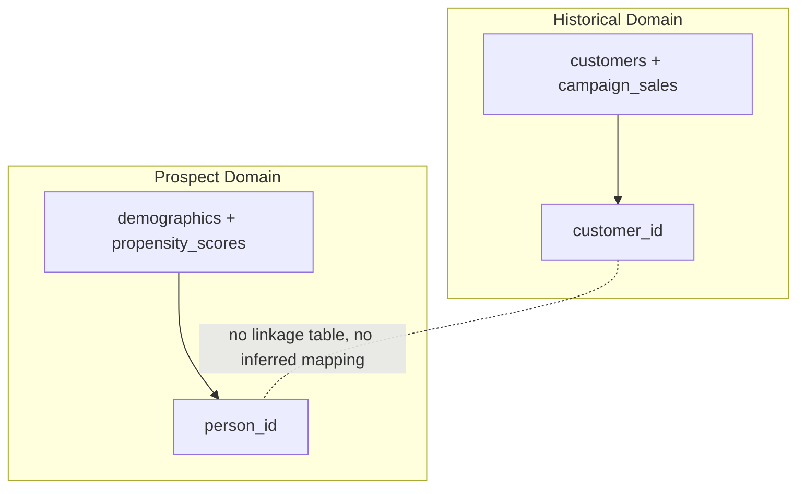
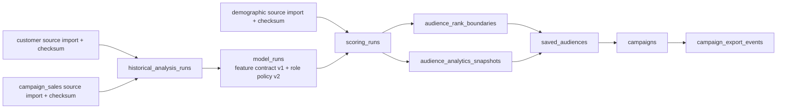
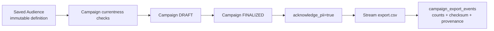

# Evidence Registry

This index classifies evidence artifacts for the Phase 1 to Phase 7 repository baseline.

Classification labels:

- CURRENT AUTHORITATIVE: current freeze gates and final acceptance artifacts.
- CURRENT SUPPORTING: supporting benchmarks and baselines used to explain current behavior.
- HISTORICAL BASELINE: valid historical checkpoints from earlier phases.
- SUPERSEDED: retained for audit trail but replaced by newer authoritative artifacts.

## CURRENT AUTHORITATIVE

| Artifact | Why current |
|---|---|
| phase7_final_acceptance_and_freeze.json | Final cross-phase acceptance gates (pip check, pytest, compileall, diff check, validate_data) and final GO decision at schema v12. |
| phase7_final_export_hardening_5m.json | Final hardened export performance/equivalence evidence at schema v12 with snapshot currentness metadata. |
| phase7_final_ui_baseline.json | Current final UI exactness baseline after full suite regression. |
| phase7_final_ui_browser_acceptance.json | Current browser acceptance across desktop/mobile breakpoints for Campaign workflows. |
| DOCUMENTATION_FREEZE_REPORT.md | Documentation freeze audit and validation report for current master docs. |

## CURRENT SUPPORTING

| Artifact | Why supporting |
|---|---|
| phase7_export_profiling_baseline.json | Baseline reference used by final export hardening evidence for equivalence checks. |
| phase6_final_analytics_performance.json | Service timing evidence used to contextualize Phase 6 audience operations at 5M scale. |
| phase6_real_5m_service_performance.json | Supplemental 5M service-level measurements. |
| phase6_step8_query_plan_and_timing.json | Query-plan and timing context for audience/search hardening decisions. |
| repository_housekeeping_inventory.json | Tracked inventory artifact for repository-freeze housekeeping traceability. |
| REPOSITORY_HOUSEKEEPING_REPORT.md | Human-readable completion report for repository housekeeping execution. |

## HISTORICAL BASELINE

| Artifact | Why historical |
|---|---|
| phase1_to_phase5_integrity_baseline.json | Earlier integrity baseline before later phase expansions. |
| phase1_to_phase5_final_integrity.json | Finalized integrity snapshot for Phase 1 to 5 scope. |
| phase5_final_corrections_validation.json | Historical validation from Phase 5 correction cycle. |
| phase5_step7_rerun_report.json | Historical rerun report retained for reproducibility record. |
| phase5_step7_validation.log | Historical Phase 5 validation log. |
| phase6_5m_acceptance.json | Historical Phase 6 5M acceptance checkpoint at schema v9. |
| phase6_performance_finalization_baseline.json | Historical performance finalization baseline. |
| phase6_prephase7_finalization_baseline.json | Historical pre-Phase-7 finalization checkpoint. |
| phase6_real_5m_performance.json | Historical 5M measurement baseline for Phase 6 cycle. |
| phase6_step9_pre_run_gates.json | Historical pre-run gate snapshot for Phase 6 Step 9. |
| phase7_baseline_and_contracts.json | Historical initial Phase 7 baseline and contracts capture. |

## SUPERSEDED

| Artifact | Superseded by |
|---|---|
| phase7_real_5m_acceptance.json | phase7_final_export_hardening_5m.json |
| phase7_section1_ui_baseline_audit.json | phase7_final_ui_baseline.json |
| phase7_section1_browser_acceptance.json | phase7_final_ui_browser_acceptance.json |

## Diagram 1: End-to-end Phase 1 to 7 flow

```mermaid
flowchart LR
  A[Phase 1 Data Foundation\nImport + Reconcile] --> B[Phase 2 Historical Analysis\nAggregate customer cohorts]
  B --> C[Phase 3 PU Model Training\nGoverned candidates + artifact]
  C --> D[Phase 5 Prospect Scoring\n5M demographic universe]
  D --> E[Phase 6 Audience Explorer\nRank prep + estimate + search + profile]
  E --> F[Immutable Saved Audience]
  F --> G[Phase 7 Campaign Builder\nDraft -> Finalized]
  G --> H[Deterministic Export\nEMAIL_CONTACT_V1 / DIRECT_MAIL_CONTACT_V1]
```

## Diagram 2: Historical customer vs prospect identity separation

## Diagram 3: Data and ML lineage

## Diagram 4: Saved audience to campaign to export

