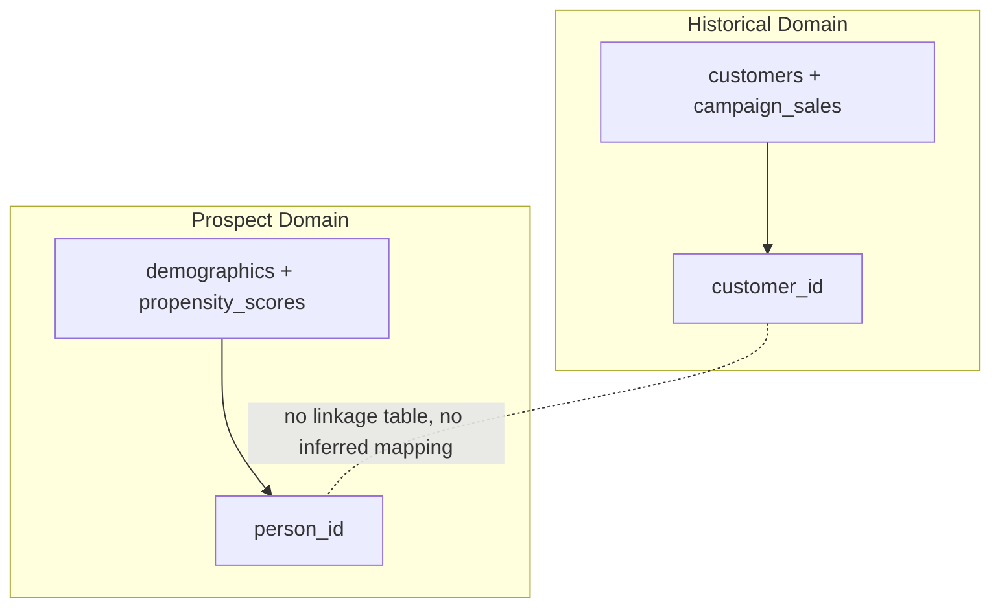
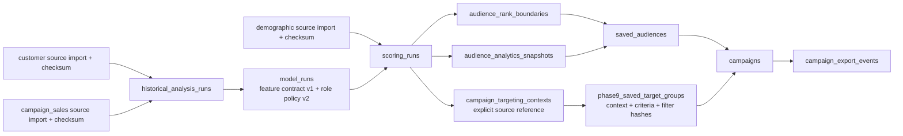
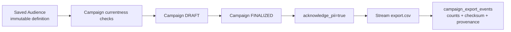

# Evidence Registry

This index classifies evidence artifacts for the Phase 1 to Phase 9 repository baseline.

Classification labels:

- CURRENT AUTHORITATIVE: current freeze gates and final acceptance artifacts.
- CURRENT SUPPORTING: supporting benchmarks and baselines used to explain current behavior.
- HISTORICAL BASELINE: valid historical checkpoints from earlier phases.
- SUPERSEDED: retained for audit trail but replaced by newer authoritative artifacts.

## CURRENT AUTHORITATIVE

| Artifact | Why current |
|---|---|
| phase7_final_acceptance_and_freeze.json | Final cross-phase acceptance gates (pip check, pytest, compileall, diff check, validate_data) and final GO decision at schema v12. |
| phase7_final_export_hardening_5m.json | Final hardened export performance/equivalence evidence at schema v12 with snapshot currentness metadata. |
| phase7_final_ui_baseline.json | Current final UI exactness baseline after full suite regression. |
| phase7_final_ui_browser_acceptance.json | Current browser acceptance across desktop/mobile breakpoints for Campaign workflows. |
| DOCUMENTATION_FREEZE_REPORT.md | Documentation freeze audit and validation report for current master docs. |
| phase8/09_browser_quality_evidence.json | Phase 8 Step 9 structured evidence: browser errors, accessibility smoke, responsive checks, and deterministic state coverage with PASS gates. |
| phase8/09_BROWSER_QUALITY_REPORT.md | Human-readable Phase 8 Step 9 browser quality report aligned to system-browser validation gates. |
| phase8/10_reproducibility_and_lfs_evidence.json | Phase 8 Step 10 structured evidence: deterministic regeneration, raw/decompressed SHA equivalence, portable paths, and LFS/duplicate-file checks. |
| phase8/10_REPRODUCIBILITY_AND_LFS_REPORT.md | Human-readable Phase 8 Step 10 reproducibility and LFS closure report with final canonical hash manifest. |
| phase8/05_system_browser_historical_analysis.json | Browser-driven Overview, Data Status, and Historical Analysis evidence. |
| phase8/06_system_browser_training_and_5m_scoring.json | Browser-submitted governed training and completed 5M scoring evidence. |
| phase8/07_system_browser_audience_explorer_all_controls.json | Complete Audience Explorer scenarios, control coverage, saved-audience lineage, and UI-only state transition evidence. |
| phase8/08_system_browser_campaign_builder_and_exports.json | Complete Campaign Builder, finalized immutability, Email/Direct Mail export, and audit evidence. |
| phase8/final_system_browser/phase8_certification_manifest.json | Step 11 strict-fresh clean-HEAD certification, official imports, browser-driven training and 5M scoring, integrity gates, artifact hashes, execution mode, and local certification decision. |
| phase8/final_system_browser/PHASE8_SYSTEM_BROWSER_CERTIFICATION_REPORT.md | Human-readable Step 11 system-browser certification report. |
| phase8/12_ci_green_branch_protection_and_phase8_freeze.json | Final Step 12 local regression, exact-SHA CI, branch-protection documentation, SHA chain, and GO decision. |
| phase8/12_master_acceptance_checklist_run.json | Machine-readable 28-item final acceptance checklist; 28 PASS, 0 FAIL, 0 PENDING. |
| phase8/12_MASTER_ACCEPTANCE_CHECKLIST_RUN.md | Human-readable final acceptance checklist and evidence map. |
| phase8/PHASE8_FINAL_ACCEPTANCE.md | Authoritative Phase 8 final report and GO decision. |
| phase9_closure/PHASE9_CLOSURE_ACCEPTANCE.md | Current authoritative Phase 9 closure/interoperability acceptance and GO status. |
| phase9_closure/README.md | Current closure evidence index, authority boundary, and reading order. |
| phase9_closure/06_REGRESSION_REPORT.md | Step 6 full regression, clean-room, compatibility, repository/LFS, and no-heavy-work evidence. |
| phase9_closure/PHASE9_FINAL_FREEZE_REPORT.md | Final Phase 9 closure SHA chain, exact-SHA CI results, Phase 10 readiness, and GO/freeze decision. |
| phase9/PHASE9_FINAL_ACCEPTANCE.md | Historical original Phase 9 regression, exact-SHA CI, documentation, handoff, and freeze decision. |
| phase9/final_system_browser/PHASE9_SYSTEM_BROWSER_CERTIFICATION_REPORT.md | Historical installed-Chrome business Campaign Planner certification for the original candidate. |
| phase9/final_system_browser/phase9_certification_manifest.json | Historical structured source, context, exact-count, telemetry, and decision evidence for the original candidate. |
| phase9/final_system_browser/ui_control_coverage.json | Phase 9 actionable-control inventory with terminal status for every control. |

## CURRENT SUPPORTING

| Artifact | Why supporting |
|---|---|
| phase7_export_profiling_baseline.json | Baseline reference used by final export hardening evidence for equivalence checks. |
| phase6_final_analytics_performance.json | Service timing evidence used to contextualize Phase 6 audience operations at 5M scale. |
| phase6_real_5m_service_performance.json | Supplemental 5M service-level measurements. |
| phase6_step8_query_plan_and_timing.json | Query-plan and timing context for audience/search hardening decisions. |
| repository_housekeeping_inventory.json | Tracked inventory artifact for repository-freeze housekeeping traceability. |
| REPOSITORY_HOUSEKEEPING_REPORT.md | Human-readable completion report for repository housekeeping execution. |
| phase9/01_PHASE9_BASELINE_AND_GAP_REPORT.md | Phase 9 baseline and gap analysis against the frozen Phase 1–8 implementation. |
| phase9/02_BUSINESS_UX_AND_TERMINOLOGY_REPORT.md | Business terminology and information-architecture rationale. |
| phase9/03_TARGETING_CONTRACT_AND_SCHEMA_REPORT.md | Schema 13/14 and targeting-contract evidence. |
| phase9/05_CAMPAIGN_CONTEXT_REPORT.md | Campaign-context normalization and persistence evidence. |
| phase9/06_TARGETING_CRITERIA_REPORT.md | Business targeting criteria and exact filter mapping. |
| phase9/07_TARGETING_INTELLIGENCE_BOUNDARY_REPORT.md | Explicit-source and no-latest-fallback evidence. |
| phase9/08_TARGET_GROUP_PREVIEW_REPORT.md | Exact preview, demographics, pagination, explanation, and privacy evidence. |
| phase9/09_MATCH_STRENGTH_RECOMMENDATION_REPORT.md | Deterministic exact-count recommendation evidence. |
| phase9/10_SAVE_TARGET_GROUP_CAMPAIGN_REPORT.md | Immutable Target Group and Campaign Draft evidence. |
| phase9/11_PROGRESSIVE_DISCLOSURE_REPORT.md | Business-default and technical-detail separation evidence. |
| phase9/12_STATE_AND_VALIDATION_REPORT.md | Validation and state-model evidence. |
| phase9/13_ACCESSIBILITY_RESPONSIVE_USABILITY_REPORT.md | Accessibility, keyboard, responsive, and usability evidence. |

## HISTORICAL BASELINE

| Artifact | Why historical |
|---|---|
| phase1_to_phase5_integrity_baseline.json | Earlier integrity baseline before later phase expansions. |
| phase1_to_phase5_final_integrity.json | Finalized integrity snapshot for Phase 1 to 5 scope. |
| phase5_final_corrections_validation.json | Historical validation from Phase 5 correction cycle. |
| phase5_step7_rerun_report.json | Historical rerun report retained for reproducibility record. |
| phase5_step7_validation.log | Historical Phase 5 validation log. |
| phase6_5m_acceptance.json | Historical Phase 6 5M acceptance checkpoint at schema v9. |
| phase6_performance_finalization_baseline.json | Historical performance finalization baseline. |
| phase6_prephase7_finalization_baseline.json | Historical pre-Phase-7 finalization checkpoint. |
| phase6_real_5m_performance.json | Historical 5M measurement baseline for Phase 6 cycle. |
| phase6_step9_pre_run_gates.json | Historical pre-run gate snapshot for Phase 6 Step 9. |
| phase7_baseline_and_contracts.json | Historical initial Phase 7 baseline and contracts capture. |

## SUPERSEDED

| Artifact | Superseded by |
|---|---|
| phase7_real_5m_acceptance.json | phase7_final_export_hardening_5m.json |
| phase7_section1_ui_baseline_audit.json | phase7_final_ui_baseline.json |
| phase7_section1_browser_acceptance.json | phase7_final_ui_browser_acceptance.json |
| phase8/01_master_acceptance_checklist_run.json | phase8/12_master_acceptance_checklist_run.json |
| phase8/01_MASTER_ACCEPTANCE_CHECKLIST_RUN.md | phase8/12_MASTER_ACCEPTANCE_CHECKLIST_RUN.md |

## Diagram 1: End-to-end Phase 1 to 9 flow

```mermaid
flowchart LR
  A[Phase 1 Data Foundation\nImport + Reconcile] --> B[Phase 2 Historical Analysis\nAggregate customer cohorts]
  B --> C[Phase 3 PU Model Training\nGoverned candidates + artifact]
  C --> D[Phase 5 Prospect Scoring\n5M demographic universe]
  D --> E[Phase 6 Audience Explorer\nRank prep + estimate + search + profile]
  E --> F[Immutable Saved Audience]
  F --> G[Phase 7 Campaign Builder\nDraft -> Finalized]
  G --> H[Deterministic Export\nEMAIL_CONTACT_V1 / DIRECT_MAIL_CONTACT_V1]
  E --> I[Phase 9 Create Campaign\nBusiness context + targeting]
  I --> J[Exact Target Group preview\nExplicit current source]
  J --> K[Immutable Target Group\nCampaign Draft]
  K --> G
```

## Diagram 2: Historical customer vs prospect identity separation

## Diagram 3: Data and ML lineage

## Diagram 4: Saved audience to campaign to export

