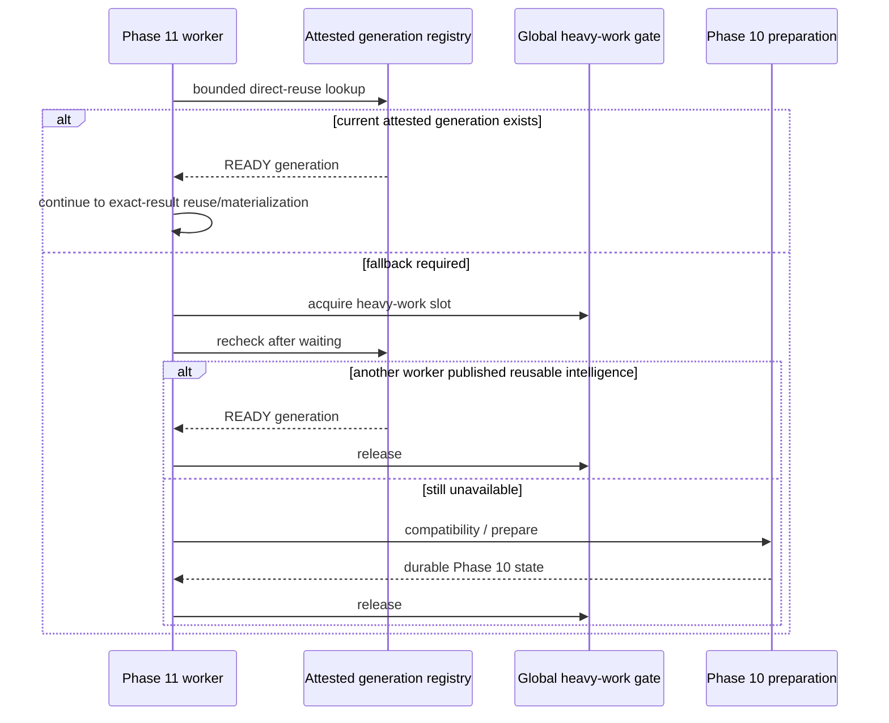

# Step 07 — Direct reuse fast path and truthful timing

## Starting SHA

`f437efd3be9e6d4945b0ee12bff91ccce2697088`

The working tree already contained the sequential, uncommitted recovery-hardening work from Steps 01–06. Step 07 preserved that work.

## Defects reproduced

1. `execute_phase11_search` acquired `_PHASE10_HEAVY_GATE` before `_phase10_state`, so the bounded attested-generation lookup waited behind unrelated compatibility/build work.
2. Search attempts were created with `started_at=created_at` while still `QUEUED`.
3. terminal `processing_seconds` was calculated from the visible run timestamp rather than the current attempt's actual processing start.
4. retries repeated the same timing error, and queue positions used the original run creation time rather than the current attempt enqueue time.

## Root cause

Cheap direct reuse and potentially heavy Phase 10 preparation shared one lock scope. Separately, the original Phase 11 run schema required a non-null run `started_at`, and that legacy value had been copied into each attempt before a worker began processing. Timing consumers then treated the queue timestamp as a processing timestamp.

## Implemented flow

- `_direct_reuse_state` performs only the bounded modeling-context lookup and current-attestation check.
- `_resolve_phase10_state` executes that lookup before the global gate and repeats it after acquiring the gate.
- `_phase10_state` now owns only the fallback Phase 10 reader/preparer path.
- The recheck prevents a waiting worker from duplicating generation/scoring work completed by the worker ahead of it.

## Timing contract

Schema version 25 corrects active/new attempt semantics without rewriting terminal history:

- `created_at` is the attempt's queue/enqueue time.
- `started_at` remains `NULL` while the attempt is queued.
- `started_at` is written atomically when the worker moves the run and attempt to `PROCESSING`.
- `completed_at` remains the terminal timestamp.
- persisted run `processing_seconds` is calculated from the current attempt's `started_at`; a run terminalized before processing records `0.0`.
- projected v2 progress exposes `queued_at`, `processing_started_at`, `completed_at`, `queue_seconds`, `processing_seconds`, and `total_elapsed_seconds`.
- retry timing uses the new attempt's timestamps; terminal prior attempts remain immutable.
- queued ordering uses current-attempt `created_at`, so a retried run rejoins the FIFO queue at its retry time.

The legacy v1 submission-status allowlist is unchanged. The meaning of the existing terminal `processing_seconds` field is corrected: it now excludes queue wait.

## UI behavior

Results cards and result detail display separate Queue Duration, Processing Duration, and Total Elapsed values. Active processing duration comes from the durable current-attempt progress projection; terminal displays continue to use the persisted terminal value.

## Tests and results

- Direct reuse while `_PHASE10_HEAVY_GATE` is held: passed.
- Two-worker race with post-gate recheck: passed; exactly one fallback build invocation.
- Queue wait excluded from processing and included in total elapsed: passed (`120s` queue, `10s` processing, `130s` total).
- Retry clock reset and terminal attempt immutability: passed (`30s` retry queue, `10s` processing, `40s` total).
- Retry FIFO position based on current attempt: passed.
- Repository/migration/lifecycle/fencing/lineage set: `78 passed`.
- Reuse/attestation/retry-rejoin/performance-gate/static-frontend set: `91 passed`.
- API/backward-compatibility and non-browser result-detail checks: `19 passed`.
- Focused Step 07 tests: `5 passed` across concurrency, timing, and queue ordering.
- `git diff --check`: passed (only existing CRLF normalization warnings were reported).

## Environment limitations and remaining risks

- Eight Playwright-backed UI tests could not start because `playwright` is not installed in the active Python environment. No package was installed as part of this prompt.
- The existing warm search-acknowledgement performance test measured approximately `1.04–1.33s` against a strict `<1.0s` gate on this Windows test environment. The Step 07 changes do not add heavy work to submission, but this broader latency gate remains open for a later performance-focused step.
- Historical terminal attempts retain their recorded timestamps as required. Therefore, projections for those historical attempts preserve their original semantics rather than rewriting evidence.

## Acceptance

**GO for Step 07.** Verified current reuse bypasses unrelated heavy computation, waiting workers recheck after the heavy gate, duplicate fallback work is prevented, and new/retry processing durations exclude queue wait.

## Recommended next prompt

`08_PROGRESS_HEARTBEAT_PHASE10_STAGE_PROPAGATION_AND_ETA.md`
